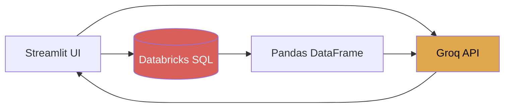
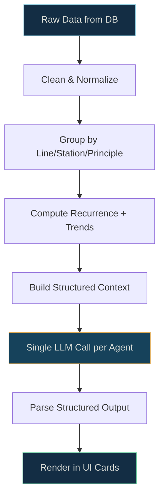

# 🔬 AutoNQ AI — Complete System Diagnostic Report

**System**: AutoNQ AI — Audit Intelligence Platform  
**Date**: 2026-04-28  
**Scope**: Full-stack audit covering Data → LLM → Architecture → UI → Output → Features → Safety

---

## 1. 🔴 DATA QUALITY ANALYSIS

### 1.1 Schema Assessment

| Field | Type | Issue |
|---|---|---|
| `line` | string | No normalization — values are `"5"`, `"6"`, `"7"` as strings, but IQIS uses `"1"`, `"2"`, `"4"` — **mismatched domains** |
| `station` | free-text | Completely uncontrolled — `"Station 4B"` vs `"station 4b"` will never match |
| `supervisor` | free-text | Typo-prone, no master data lookup |
| `observation_text` | free-text | Vague, inconsistent granularity — "Oil leakage found near conveyor belt" vs "Operator skipped visual check" |
| `ai_principle` | LLM-classified | Defaults to `"Instructions"` on failure — silent data corruption |
| `date` | datetime | Coerced with `errors="coerce"` — nulls silently dropped |
| `shift` | enum-like | Fixed to 3 options — safe, but no validation on DB insert |
| `image_base64` | blob | Stored as base64 text in SQL — massive storage waste, no CDN |

### 1.2 Critical Data Issues

> [!CAUTION]
> **Silent Data Corruption**: When `detect_principle()` fails, it returns `"Instructions"` as a default. This means LLM failures silently pollute your analytics with false "Instructions" classifications. You have **no way to distinguish** real "Instructions" deviations from LLM failures.

**Duplicates**: No deduplication mechanism exists. The same observation text submitted twice creates two entries. No unique constraint on `(line, station, date, observation_text)`.

**Missing Fields**: `station` and `supervisor` are fully optional in the UI (`st.text_input` with no validation). Empty submissions are possible.

**Vague Text**: Observation text quality depends entirely on the operator. No minimum length, no structured prompts, no templates.

### 1.3 Enrichment Recommendations (Before LLM)

```
CURRENT:  raw_text → LLM (classify)
PROPOSED: raw_text → normalize → deduplicate → enrich_context → LLM (classify)
```

| Step | Implementation |
|---|---|
| **Normalize station** | Map free-text to canonical station IDs via fuzzy match |
| **Normalize supervisor** | Dropdown from master data (already partly done) |
| **Deduplicate** | Hash `(line + station + observation_text_normalized)`, reject if seen in last 24h |
| **Enrich context** | Append historical recurrence count + last occurrence date to the LLM prompt |
| **Validate principle** | If LLM returns a principle not in the list, flag as `"UNCLASSIFIED"` instead of defaulting |

---

## 2. 🧠 LLM OUTPUT ANALYSIS

### 2.1 Current LLM Configuration

| Parameter | Value | Problem |
|---|---|---|
| Model | `llama-3.1-8b-instant` | Small model — good for speed, weak on structured output |
| Max tokens | `300` (hardcoded, ignores the `max_tokens=200` param) | Too low for complex outputs like process audit sheets |
| Temperature | `0.2` | Reasonable for classification, but identical for all tasks |
| Retries | `2` (defined but never used) | The retry parameter is accepted but the code has no retry loop |

> [!WARNING]
> **`max_tokens` is hardcoded to 300 in `BoschLLMClient.chat()`** regardless of the `max_tokens` parameter passed. This truncates longer outputs (weekly/monthly briefs, corrective actions, audit questions).

### 2.2 Output Quality Assessment

| Agent | Quality | Issue |
|---|---|---|
| `detect_principle` | ⚠️ Medium | Falls back to "Instructions" silently; no confidence score |
| `generate_daily_brief` | ❌ No LLM used | Pure template — static string formatting, **not actually AI-generated** |
| `generate_weekly_brief` | ⚠️ Medium | Uses pre-aggregated stats → prompt is reasonable but outputs can be generic |
| `generate_monthly_brief` | ⚠️ Medium | Same pattern — LLM receives aggregated data, not raw deviations |
| `generate_mail_from_summary` | ✅ Adequate | Simple reformatting task — model handles well |
| `generate_external_audit_tracker_with_ai` | ❌ Critical | **N+1 LLM call pattern** — one API call PER issue (5-10 sequential calls) |
| `map_deviation_category_ai` | ⚠️ Medium | Sends ALL observations in one prompt — will hit token limits with >50 observations |

### 2.3 Prompt Engineering Gaps

**Corrective Actions** ([setup_environment.py:610-626](file:///d:/Hack19/setup_environment.py#L610-L626)):
```diff
- "Suggest one practical corrective action"
+ "Suggest one specific corrective action using the 5W1H format:
+  WHO should do WHAT, WHERE, WHEN, and HOW.
+  Reference the specific station and issue.
+  Output format: [Action] | [Owner] | [Deadline]"
```

**Summaries** — The daily brief doesn't use LLM at all ([setup_environment.py:43-67](file:///d:/Hack19/setup_environment.py#L43-L67)):
```python
# CURRENT: Pure template, not AI
message = f"Increase in {dominant_principle} issues at Station {dominant_station}..."

# PROPOSED: Send raw deviation data to LLM with structured output instructions
```

**Deviation Analysis** — Category mapping prompt asks for `→` separator but parsing is fragile:
```diff
- Return output as numbered list: Observation Number → Category Name
+ Return output as JSON array: [{"index": 1, "category": "Oil Leak"}, ...]
```

### 2.4 Recommended Model-Level Improvements

| Change | Impact |
|---|---|
| Increase `max_tokens` to 600 for summaries, 1000 for audit sheets | Prevents truncation |
| Add `temperature=0.0` for classification, `0.3` for generation | Better determinism |
| Switch to JSON mode / structured output | Eliminates parsing failures |
| Batch corrective actions into ONE prompt (table format) | Reduces 5-10 API calls to 1 |
| Add retry logic with exponential backoff | Handles transient Groq failures |

---

## 3. ⚙️ LOGIC & ARCHITECTURE ANALYSIS

### 3.1 Architecture Diagram (Current)



### 3.2 Critical Inefficiencies

#### 🔴 N+1 LLM Call Pattern — External Tracker

```python
# setup_environment.py:603-631 — CURRENT
for _, row in top_issues.iterrows():    # 5-10 iterations
    action_response = llm.chat(...)      # 1 API call each = 5-10 total
```

**Fix**: Batch all issues into a single prompt with table output:

```python
# PROPOSED: Single call
prompt = "For each issue below, suggest ONE corrective action:\n"
for _, row in top_issues.iterrows():
    prompt += f"- Line {row['line']}, Station {row['station']}: {row['observation_text']} (x{row['Recurrence_Count']})\n"
prompt += "\nReturn as table: Issue | Corrective Action | Owner | Deadline"
```

#### 🔴 Hardcoded Credentials — 3 Separate Locations

| Location | Line | What's Exposed |
|---|---|---|
| [app.py:234-236](file:///d:/Hack19/app.py#L234-L236) | `get_connection()` | Databricks host, path, token |
| [app.py:262-264](file:///d:/Hack19/app.py#L262-L264) | `get_fresh_connection()` | Same credentials duplicated |
| [setup_environment.py:20](file:///d:/Hack19/setup_environment.py#L20) | `BoschLLMClient.__init__` | Groq API key |

> [!CAUTION]
> **All credentials are hardcoded in source code** despite a `.env` file existing. The `.env` values are NEVER read by the application. `os.getenv()` is never called.

**Fix**:
```python
import os
from dotenv import load_dotenv
load_dotenv()

host = os.getenv("DATABRICKS_HOST")
token = os.getenv("DATABRICKS_TOKEN")
groq_key = os.getenv("GROQ_API_KEY")
```

#### 🟡 No Data Preprocessing Pipeline

```
CURRENT:   raw_df → passed directly to LLM as dict/text
PROPOSED:  raw_df → clean → group → aggregate → context_enriched → LLM
```

The `generate_external_audit_tracker_with_ai` passes raw `full_data.to_dict(orient="records")` (up to 2000 rows) but only uses the grouped top-N. The grouping happens inside the function, but the full data transfer is wasteful.

#### 🟡 Duplicate DB Connection Functions

Three separate connection mechanisms exist:
1. `get_connection()` — cached `@st.cache_resource`
2. `safe_get_connection()` — retry wrapper
3. `get_fresh_connection()` — uncached, used for writes

This is actually reasonable for read vs write separation, but `get_fresh_connection()` duplicates credentials and has no error handling.

#### 🟡 Q-Check Saves to Local CSV

```python
# app.py:811-817
file_path = "daily_qcheck_log.csv"
df.to_csv(file_path, index=False)   # Local file, lost on redeploy
```

This should persist to Databricks alongside other audit data.

### 3.3 Recommended Pipeline



---

## 4. 🎨 UI/UX ANALYSIS

### 4.1 Current UI Problems

| Issue | Location | Severity |
|---|---|---|
| **Observation input is `st.text_input`** (single line) | [app.py:538](file:///d:/Hack19/app.py#L538) | 🔴 Critical — operators need multi-line descriptions |
| **AI output rendered as `white-space: pre-wrap` raw text** | [ui_styles.py:1066](file:///d:/Hack19/ui_styles.py#L1066) | 🔴 Critical — no bullet formatting, no hierarchy |
| **No visual distinction between AI agents** | All summary outputs | 🟡 Medium — daily/weekly/monthly all look identical |
| **Mail preview uses raw `st.text_area`** | [app.py:674-678](file:///d:/Hack19/app.py#L674-L678) | 🟡 Medium — no rich preview mode |
| **Q-Check form uses columns for every row** | [app.py:784-802](file:///d:/Hack19/app.py#L784-L802) | 🟡 Medium — gets cramped on mobile |
| **No loading skeleton / shimmer** | All pages | 🟡 Medium — `LOADING_HTML` exists in ui_styles.py but is never used |
| **KPI cards are static** | Header section | 🟢 Low — no trend indicators despite `trend` param support |
| **Status badge always shows "Online"** | [app.py:475](file:///d:/Hack19/app.py#L475) | 🟢 Low — hardcoded `True`, doesn't reflect actual DB status |

### 4.2 Observation Input — Before/After

```diff
- obs_text = st.text_input("Observation", placeholder="Describe the observation...")
+ obs_text = st.text_area(
+     "Observation",
+     placeholder="Describe what you observed...\nInclude: location, issue, severity",
+     height=120,
+     key="obs_input_main"
+ )
```

### 4.3 AI Output Rendering — Structured Cards

The `ai_output_card()` currently dumps raw LLM text. It should parse markdown:

```python
# CURRENT: Raw text dump
st.markdown(ai_output_card("Daily Summary", raw_text), unsafe_allow_html=True)

# PROPOSED: Parse LLM output into structured sections
def render_ai_output(title, content):
    """Parse AI output and render as structured card with sections."""
    sections = parse_sections(content)  # Split by headers/bullet groups
    
    with st.container():
        st.markdown(f"### 🤖 {title}")
        for section in sections:
            if section.type == "action":
                st.warning(section.text)    # Action items highlighted
            elif section.type == "bullets":
                for b in section.items:
                    st.markdown(f"• {b}")
            else:
                st.info(section.text)
```

### 4.4 Layout Recommendations

| Area | Current | Recommended |
|---|---|---|
| Audit Entry form | Two columns, cramped | Single column with clear section dividers |
| Summary page | Vertical stack of buttons → outputs | Tab-based: Daily \| Weekly \| Monthly |
| External Tracker | Raw data editor | Card per issue with expandable details |
| Repeatability | Pivot table only | Heatmap visualization + table |
| Q-Check form | Column-based per row | `st.data_editor` with proper column config |

---

## 5. 📊 OUTPUT FORMATTING ISSUES

### 5.1 Why Outputs Look Messy

The root cause is a **format mismatch chain**:

```
LLM returns → free-form text with markdown
    ↓
ai_output_card() renders → white-space: pre-wrap (raw text, no parsing)
    ↓
User sees → unformatted wall of text with asterisks and dashes visible
```

### 5.2 Specific Formatting Failures

| Output | Problem | Fix |
|---|---|---|
| Weekly/Monthly Summary | LLM returns markdown bullets but displayed as raw text | Parse with `st.markdown()` inside a styled container |
| Corrective Actions | Single sentences without structure | Force LLM to return `Action \| Owner \| Deadline` table format |
| Mail Preview | Raw text in `st.text_area`, no rich preview | Side-by-side: raw edit + rendered preview |
| Audit Questions | Numbered list as plain text | Parse into `st.checkbox` items for interactive use |
| Deviation Categories | `→` separator parsed into dict, then displayed in pivot | Display as tag chips with color coding |

### 5.3 Conversion Strategy

**Bullet Points** — Instruct LLM to use numbered lists, parse with regex:
```python
def format_bullets(text):
    lines = text.strip().split('\n')
    formatted = []
    for line in lines:
        line = line.strip()
        if line.startswith(('- ', '• ', '* ')):
            formatted.append(f"<li>{line[2:]}</li>")
        elif line and line[0].isdigit() and '.' in line[:3]:
            formatted.append(f"<li>{line.split('.', 1)[1].strip()}</li>")
        else:
            formatted.append(f"<p>{line}</p>")
    return f"<ul>{''.join(formatted)}</ul>"
```

**Tables** — Use `st.dataframe()` for structured data, not `st.markdown()`:
```python
# For corrective actions — force JSON output from LLM
actions = json.loads(llm_response)
df = pd.DataFrame(actions)
st.dataframe(df, use_container_width=True)
```

**Sections** — Use `st.expander()` for long outputs:
```python
with st.expander("📋 Detailed Findings", expanded=True):
    st.markdown(parsed_content)
with st.expander("🎯 Action Items"):
    st.markdown(action_items)
```

---

## 6. 🚀 ADVANCED FEATURE SUGGESTIONS

### 6.1 Image Upload / Camera Integration

**Current State**: ✅ Already implemented — camera capture + file upload in Audit Entry  
**Gap**: Images are stored as base64 in the DB (`image_base64` column) — very inefficient

**Recommended Upgrade**:
| Step | Implementation |
|---|---|
| Store images in Azure Blob Storage / S3 | Upload on submit, store URL in DB |
| Add image compression | Resize to 800x600 max before storage |
| Add AI image analysis | Send image to vision model for automated observation extraction |
| Add image gallery view | Show reference photos in Q-Check and Process Audit |

### 6.2 Status Tracking (Open / In Progress / Closed)

**Current State**: Status column exists in External Tracker but:
- Not persisted to database (lost on page refresh)
- No timestamps for status changes
- No workflow enforcement (can skip from "Not Started" to "Solved")

**Recommended Schema**:
```sql
CREATE TABLE audit_ai.issue_tracker (
    issue_id        STRING PRIMARY KEY,
    line            STRING,
    station         STRING,
    observation     STRING,
    status          STRING DEFAULT 'Open',    -- Open | In Progress | Closed
    assigned_to     STRING,
    created_date    TIMESTAMP,
    updated_date    TIMESTAMP,
    closed_date     TIMESTAMP,
    corrective_action STRING,
    root_cause      STRING,
    effectiveness_check BOOLEAN DEFAULT FALSE
);
```

### 6.3 Smart Grouping of Issues

**Current**: `map_deviation_category_ai` groups via LLM — expensive, inconsistent  
**Recommended**: Hybrid approach

```
Step 1: Rule-based pre-grouping using keyword matching
        "oil leak" → Contamination
        "missing label" → Labeling
        "not calibrated" → Equipment

Step 2: LLM handles ambiguous cases only

Step 3: Cache mappings — same observation text = same category
```

### 6.4 Auto-Tagging (Safety, Quality, Process)

Add a severity/domain tag system:

| Tag Category | Values | Source |
|---|---|---|
| Domain | Safety, Quality, Process, Environment | Rule-based from `ai_principle` mapping |
| Severity | Critical, Major, Minor | LLM-assessed or rule-based from recurrence count |
| Priority | P1, P2, P3 | Computed: severity × recurrence × line criticality |

**Implementation**: Add to `detect_principle()` — extend to return `{principle, domain, severity}`:

```python
PRINCIPLE_DOMAIN_MAP = {
    "Stop Sign": "Safety",
    "Andon Cord": "Safety", 
    "Dropped Parts": "Safety",
    "Rework / Scrap": "Quality",
    "Labeling": "Quality",
    "Measurement / Test Equipment": "Quality",
    "1C – Cleanliness": "Process",
    "Instructions": "Process",
    "Process Parameters": "Process",
    # ...
}
```

### 6.5 Additional High-Value Features

| Feature | Value | Effort |
|---|---|---|
| **Trend sparklines in KPI cards** | Visual trend at a glance | Low |
| **Audit calendar view** | When was each line last audited | Medium |
| **Comparative line performance** | Side-by-side line health dashboard | Medium |
| **Auto-escalation rules** | If issue recurs >3x, auto-notify manager | Medium |
| **PDF report export** | One-click downloadable audit report | Medium |
| **Real-time notifications** | Webhook for critical findings | High |
| **Multi-language support** | For international Bosch plants | High |

---

## 7. 🛡️ SYSTEM SAFETY & STABILITY

### 7.1 Critical Risks (Fix Immediately)

> [!CAUTION]
> **Exposed Credentials**: Databricks token and Groq API key are hardcoded in source files. If this repo is public or shared, these are compromised.

**Action**: 
1. Rotate ALL credentials immediately
2. Move to `os.getenv()` + `.env` file
3. Add `.env` to `.gitignore`
4. Use secrets manager in production

### 7.2 Safe Refactoring Sequence

This is the order to refactor without breaking the running system:

```
Phase 1: ZERO-RISK FIXES (no logic changes)
├── Move credentials to os.getenv()
├── Fix max_tokens hardcode (use the parameter)
├── Change observation input from text_input to text_area
└── Add input validation (non-empty station, supervisor)

Phase 2: LOW-RISK IMPROVEMENTS (better UX, same backend)
├── Parse AI output as markdown (render bullets/headers)
├── Add loading shimmer (LOADING_HTML already exists)
├── Use st.data_editor for Q-Check form
├── Add trend indicators to KPI cards
└── Add actual DB connection status to sidebar badge

Phase 3: MEDIUM-RISK REFACTORING (architecture changes)
├── Batch LLM calls in External Tracker (N→1)
├── Add retry logic to BoschLLMClient
├── Persist Q-Check data to Databricks (not CSV)
├── Add issue status tracking table
└── Add structured JSON output mode for LLM

Phase 4: HIGH-IMPACT FEATURES (new capabilities)
├── Image storage migration (base64 → blob storage)
├── Auto-tagging system (domain + severity)
├── PDF report generation
├── Hybrid rule+LLM classification
└── Comparative dashboard
```

### 7.3 Testing Safety Net

Before each phase, ensure:

| Check | How |
|---|---|
| DB connectivity | Run `safe_get_connection()` health check |
| LLM availability | Test `detect_principle("test observation")` |
| Data integrity | Compare row counts before/after migration |
| UI rendering | Screenshot comparison of each page |
| Session state | Verify `st.session_state` keys preserved across page changes |

### 7.4 Deployment Safety

```python
# Add this to app.py at startup
import sys

def system_health_check():
    checks = {}
    
    # DB Check
    try:
        conn = safe_get_connection()
        checks["database"] = conn is not None
    except:
        checks["database"] = False
    
    # LLM Check
    try:
        result = llm.chat([{"role": "user", "content": "ping"}])
        checks["llm"] = "unavailable" not in result.lower()
    except:
        checks["llm"] = False
    
    # .env Check
    checks["credentials_secure"] = all([
        os.getenv("DATABRICKS_TOKEN"),
        os.getenv("GROQ_API_KEY")
    ])
    
    return checks
```

---

## Summary: Priority Action Matrix

| Priority | Action | File | Impact |
|---|---|---|---|
| 🔴 P0 | Remove hardcoded credentials → `os.getenv()` | `app.py`, `setup_environment.py` | Security |
| 🔴 P0 | Fix `max_tokens` hardcode | `setup_environment.py:28` | Output quality |
| 🔴 P0 | Fix silent principle fallback (`"Instructions"` → `"UNCLASSIFIED"`) | `app.py:405` | Data integrity |
| 🟡 P1 | Change `st.text_input` → `st.text_area` for observation | `app.py:538` | UX |
| 🟡 P1 | Batch External Tracker LLM calls (N→1) | `setup_environment.py:603-631` | Performance, cost |
| 🟡 P1 | Parse AI output as markdown (not raw pre-wrap) | `ui_styles.py:1066`, `app.py` | Readability |
| 🟢 P2 | Add input validation (station, supervisor required) | `app.py:553-567` | Data quality |
| 🟢 P2 | Persist Q-Check to Databricks (not CSV) | `app.py:811-818` | Data persistence |
| 🟢 P2 | Add structured JSON output for LLM responses | `setup_environment.py` (all agents) | Reliability |
| 🔵 P3 | Image storage migration (base64 → blob) | `app.py:321-325` | Storage efficiency |
| 🔵 P3 | Auto-tagging system | New module | Feature |
| 🔵 P3 | Issue lifecycle tracking table | New table + UI | Feature |

---

> [!IMPORTANT]
> **Start with Phase 1** — credential security and the `max_tokens` fix. These are zero-risk changes that immediately improve security and output quality. Every subsequent phase builds on a secure, stable foundation.
